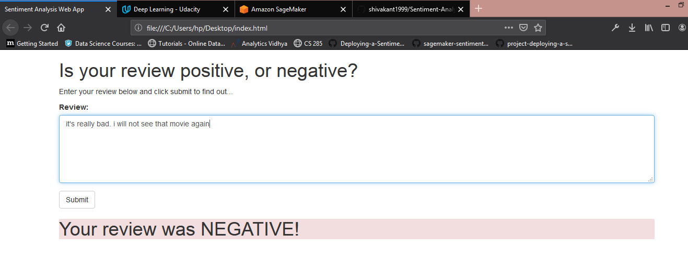

# SageMaker Deployment Project

The notebook and Python files provided here, result in a simple web app which interacts with a deployed recurrent neural network performing sentiment analysis on movie reviews. This project assumes some familiarity with SageMaker, the mini-project, Sentiment Analysis using XGBoost, should provide enough background.

# web App Diagram

# output

